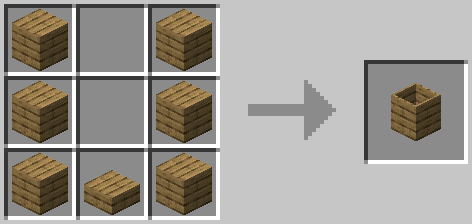
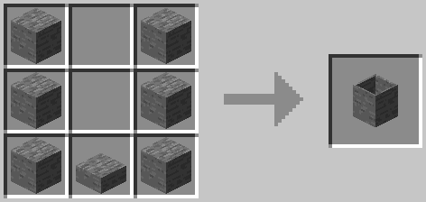

# Barrel

The barrel has a wide range of uses. You can use it to compost organics into dirt, transform one fluid into another, transform a fluid into a block with an item, and spawn mobs. When in the rain, the barrel will collect water. Right click the barrel to get a block out of the barrel. Right click the barrel with a bucket to add or remove a fluid.

Wood barrels cannot accept hot fluids. Stone barrels can accept hot fluids. Water has a temperature of 300. Anything over 433 will not go into a wood barrel.

!!! Warning
    Once a compost item is in the barrel, it cannot be removed. A barrel will void any fluid in it when it is broken.
    
## Recipe

- 6x Wood Plank (Any)
- 1x Wood Slab (Any)

---

- 6x Stone
- 1x Stone Stab

## Fluid Transformation
The combination of some fluids and blocks will interact and transform the fluid in the barrel. The barrel must be full of the fluid and the block placed directly below the full barrel.

=== "Sea Water"
    | Fluid | Block |
    | ----- | ----- |
    | Water | Sand  |
=== "Witchwater"
    | Fluid | Block    |
    | ----- | -------- |
    | Water | Mycelium |
## Fluid Block Transformation
When certain blocks or items are right clicked on a full barrel, the fluid will transform into a solid block consuming the block or item.
=== "Brain Coral Block"
    | Fluid     | Item             |
    | --------- | ---------------- |
    | Sea Water | Brain Coral Seed |
=== "Brain Coral Wall Fan"
    | Fluid     | Block           |
    | --------- | --------------- |
    | Sea Water | Brain Coral Fan |
=== "Bubble Coral Block"
    | Fluid     | Item              |
    | --------- | ----------------- |
    | Sea Water | Bubble Coral Seed |
=== "Bubble Coral Wall Fan"
    | Fluid     | Block            |
    | --------- | ---------------- |
    | Sea Water | Bubble Coral Fan |
=== "Clay"
    | Fluid | Block |
    | ----- | ----- |
    | Water | Dust  |
=== "End Stone"
    | Fluid | Item           |
    | ----- | -------------- |
    | Lava  | Glowstone Dust |
=== "Fire Coral Block"
    | Fluid     | Item            |
    | --------- | --------------- |
    | Sea Water | Fire Coral Seed |
=== "Fire Coral Wall Fan"
    | Fluid     | Block          |
    | --------- | -------------- |
    | Sea Water | Fire Coral Fan |
=== "Horn Coral Block"
    | Fluid     | Item            |
    | --------- | --------------- |
    | Sea Water | Horn Coral Seed |
=== "Horn Coral Wall Fan"
    | Fluid     | Block          |
    | --------- | -------------- |
    | Sea Water | Horn Coral Fan |
=== "Netherrack"
    | Fluid | Item          |
    | ----- | ------------- |
    | Lava  | Redstone Dust |
=== "Slime"
    | Fluid      | Item           |
    | ---------- | -------------- |
    | Witchwater | Red Mushroom   |
    | Witchwater | Brown Mushroom |
=== "Soul Sand"
    | Fluid      | Block |
    | ---------- | ----- |
    | Witchwater | Sand  |
=== "Tube Coral Block"
    | Fluid     | Item            |
    | --------- | --------------- |
    | Sea Water | Tube Coral Seed |
=== "Tube Coral Wall Fan"
    | Fluid     | Block          |
    | --------- | -------------- |
    | Sea Water | Tube Coral Fan |
## Fluid On Top
Filling the barrel with a fluid and placing another fluid in the block space above the barrel will result in the fluid in the barrel becoming solid.

=== "Cobblestone"
    | Fluid In Barrel | Fluid On Top |
    | --------------- | ------------ |
    | Water           | Lava         |
=== "Obsidian"
    | Fluid In Barrel | Fluid On Top |
    | --------------- | ------------ |
    | Lava            | Water        |

## Mob Spawning
Mobs can be spawned from the barrel by filling it with a specific fluid and right clicking the appropriate doll onto the barrel.

=== "Bee"
    | Doll         | Fluid      |
    | ------------ | ---------- |
    | Buzzing Doll | Witchwater |
=== "Blaze"
    | Doll         | Fluid |
    | ------------ | ----- |
    | Blazing Doll | Lava  |
=== "Enderman"
    | Doll          | Fluid      |
    | ------------- | ---------- |
    | Creeping Doll | Witchwater |
=== "Guardian"
    | Doll            | Fluid |
    | --------------- | ----- |
    | Protecting Doll | Water |
=== "Shulker"
    | Doll          | Fluid      |
    | ------------- | ---------- |
    | Floating Doll | Witchwater |
## Compostable Blocks and Items
The following are items and blocks that can be composted. A barrel begins composting when it reaches a solid amount of 1000.

|                   |                  |
| ----------------- | ---------------- |
| All Saplings      | Sugar Cane       |
| All Leaves        | Tall Grass       |
| All Flowers       | Vine             |
| All Fish          | Lily Pad         |
| All Cooked Meat   | Poisonous Potato |
| All Uncooked Meat | Baked Potato     |
| All Seeds         | Cactus           |
| Wheat             | Jack-O-Lantern   |
| Carrot            | Carved Pumpkin   |
| Beetroot          | Pumpkin          |
| Potato            | Mellon           |
| Nether Wart       | Mellon Slice     |
| Eggs              | Apple            |
| String            | Cooked Silkworm  |
| Rotten Flesh      | Silkworm         |
| Spider Eye        | Pumpkin Pie      |
| Bread             | Mushrooms        |
   
   
       

      
   
       
       
 
  
        
    

      
          
     
        