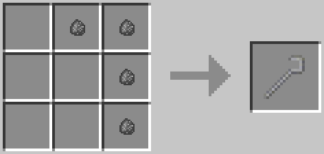
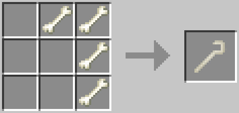
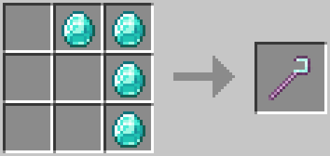
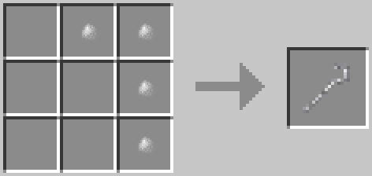
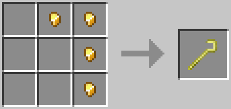
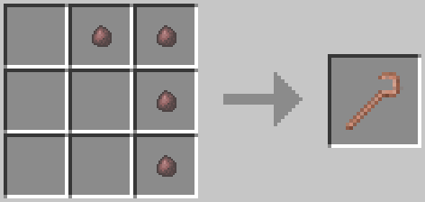
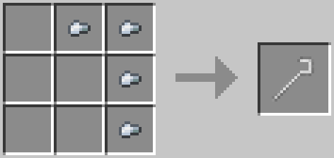
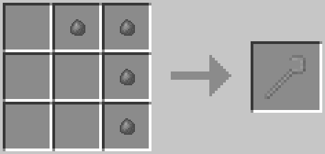
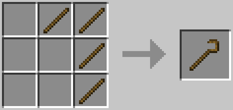

# Crooks

Crooks are used to obtain resources from leaves. Silkworms can be obtained by breaking leaves with crooks. The only difference between crooks is their durability.

## Recipes

| Crook    | Recipe                                 |
| -------- | -------------------------------------- |
| Andesite |  |
| Bone     |      |
| Diamond  |   |
| Diorite  |   |
| Gold     |      |
| Granite  |   |
| Iron     |      |
| Stone    |     |
| Wooden   |      |