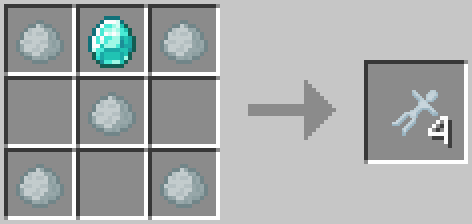
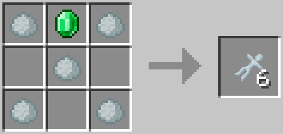
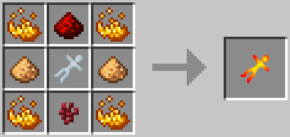
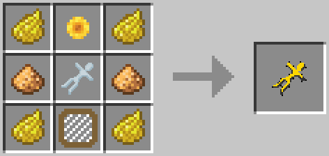
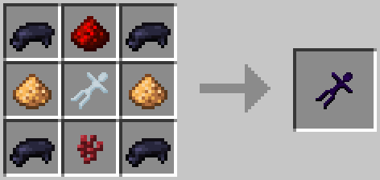
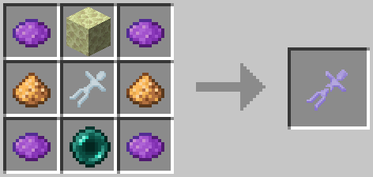
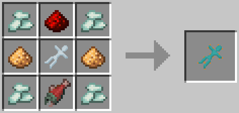

# Dolls
Dolls are used to spawn mobs in a barrel. To spawn a mob craft the doll for the entity you want to spawn and then right click on a barrel with the right fluid in it to spawn (See [Barrel Mob Spawning])

## Recipes

| Doll            | Recipe                                | Ingredients                                                                                                                      |
| --------------- | ------------------------------------- | -------------------------------------------------------------------------------------------------------------------------------- |
| Porcelain Doll  |        | <ul><li>5x Porcelain Clay</li><li>1x Diamond</li></ul>                                                                           |
|                 |        | <ul><li>5x Porcelain Clay</li><li>1x Emerald</li></ul>                                                                           |
| Blazing Doll    |     | <ul><li>4x Blaze Powder</li><li>1x Redstone</li><li>1x Porcelain Doll</li><li>1x Nether Wart</li><li>2x Glowstone Dust</li></ul> |
| Buzzing Doll    |       | <ul><li>4x Yellow Dye</li><li>1x Flower (Any)</li><li>1x Porcelain Doll</li><li>1x Beehive Frame</li><li>2x Glowstone</li></ul>  |
| Creeping Doll   |  | <ul><li>4x Black Dye</li><li>1x Redstone</li><li>1x Porcelain Doll</li><li>1x Nether Wart</li><li>2x Glowstone Dust</li></ul>    |
| Floating Doll   |   | <ul><li>4x Purple Dye</li><li>1x End Stone</li><li>1x Porcelain Doll</li><li>1x Ender Pearl</li><li>2x Glowstone Dust</li></ul>  |
| Protecting Doll |  | <ul><li>4x Prismarine Crystal</li><li>1x Redstone</li><li>1x Porcelain Doll</li><li>1x Fish</li><li>2x Glowstone Dust</li></ul>  |

[Barrel Mob Spawning]: ../barrel/#mob-spawning